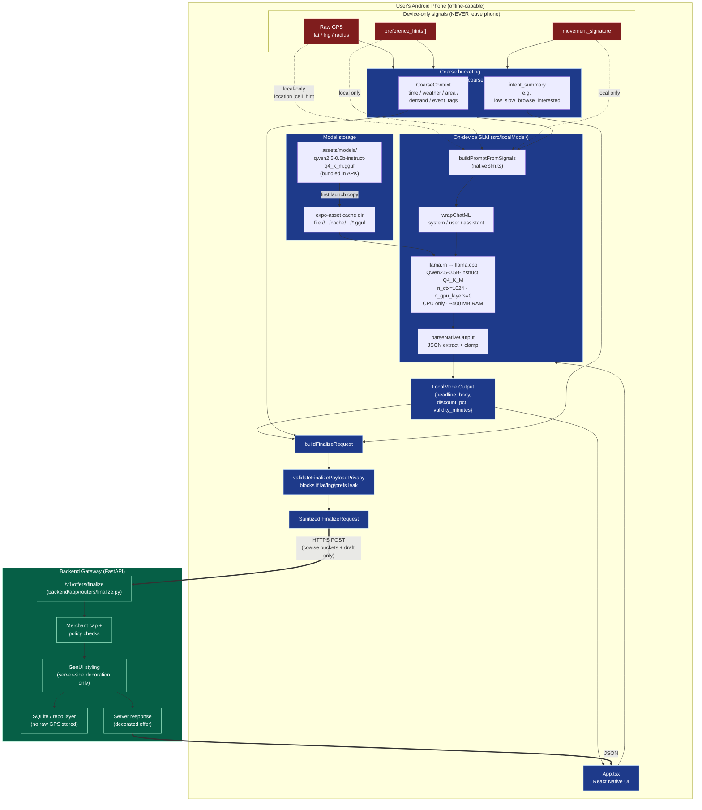
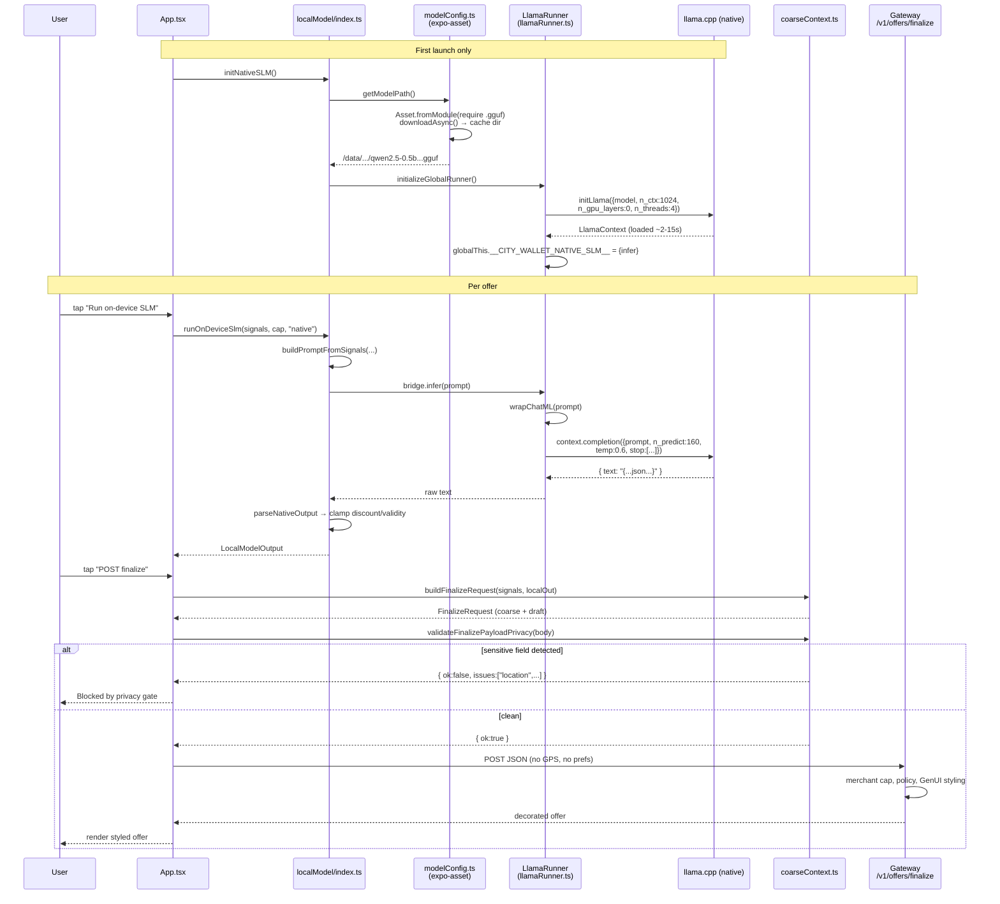

# City Wallet — Architecture

End-to-end design of the on-device SLM offer-generation flow. The privacy
guarantee is simple: **the language model runs entirely on the user's Android
phone, and only coarse, non-identifying buckets plus the model's already-drafted
offer are sent to the backend gateway.**

---

## 1. High-level flow



---

## 2. Sequence — single offer generation



---

## 3. Privacy boundary — what crosses the wire

```mermaid
flowchart LR
    subgraph ON["On-device only"]
        A1["lat / lng / radius_m"]
        A2["preference_hints<br/>['coffee','warm']"]
        A3["movement_signature<br/>'slow_browse'"]
        A4["Full prompt to SLM"]
        A5["Raw model output"]
    end

    subgraph WIRE["Sent to backend"]
        B1["session_id"]
        B2["client_pseudonym"]
        B3["merchant_id"]
        B4["intent_summary<br/>(coarse string)"]
        B5["coarse_context<br/>{time_bucket, weather_bucket,<br/>area_bucket, demand_bucket,<br/>event_tags}"]
        B6["local_model_output<br/>{headline, body,<br/>discount_pct,<br/>validity_minutes}"]
        B7["gen_ui_draft<br/>{badge_text}"]
    end

    A1 -.->|bucketed| B5
    A2 -.->|abstracted| B4
    A3 -.->|abstracted| B4
    A4 -.x|never| WIRE
    A5 -.->|clamped & sanitized| B6

    style A1 fill:#7f1d1d,color:#fff
    style A2 fill:#7f1d1d,color:#fff
    style A3 fill:#7f1d1d,color:#fff
    style A4 fill:#7f1d1d,color:#fff
    style A5 fill:#991b1b,color:#fff
    style B1 fill:#065f46,color:#fff
    style B2 fill:#065f46,color:#fff
    style B3 fill:#065f46,color:#fff
    style B4 fill:#065f46,color:#fff
    style B5 fill:#065f46,color:#fff
    style B6 fill:#065f46,color:#fff
    style B7 fill:#065f46,color:#fff
```

---

## 4. Component map

| Layer | File | Role |
|---|---|---|
| **UI** | `App.tsx` | Backend selector (mock/native), buttons, status, payload preview |
| **SLM dispatcher** | `src/localModel/index.ts` | `initNativeSLM`, `runOnDeviceSlm` (mock/native fallback) |
| **Mock backend** | `src/localModel/mockSlm.ts` | Pure-JS heuristic offer for dev / Expo Go |
| **Native bridge** | `src/localModel/nativeSlm.ts` | Builds prompt, calls `globalThis.__CITY_WALLET_NATIVE_SLM__.infer`, parses JSON |
| **Native runner** | `src/localModel/llamaRunner.ts` | Wraps `llama.rn`: `initLlama` + `context.completion`, ChatML, 120 s load timeout |
| **Asset loader** | `src/localModel/modelConfig.ts` | `expo-asset` resolves bundled `.gguf` → cache dir path |
| **Metro config** | `metro.config.js` | Registers `gguf` as asset extension |
| **Privacy gate** | `src/privacy/coarseContext.ts` | Bucket builder + outbound payload scanner |
| **Network client** | `src/api/finalizeClient.ts` | `POST /v1/offers/finalize` |
| **Gateway** | `backend/app/routers/finalize.py` | Receives sanitized payload, applies merchant policy + GenUI styling |

---

## 5. Trust boundary — one-liner

> Phone (trusted, private) → SLM produces offer draft → Privacy gate strips/validates → HTTPS → Gateway (sees coarse buckets + draft only, never raw GPS or prefs).

---

## 6. Build & run notes

`llama.rn` is a native module — **Expo Go cannot run the native backend**. To
test it on a real phone:

```powershell
# 1. Place the gguf at assets/models/qwen2.5-0.5b-instruct-q4_k_m.gguf
#    (download from https://huggingface.co/Qwen/Qwen2.5-0.5B-Instruct-GGUF)

# 2. Generate native projects
npx expo prebuild --clean

# 3. Build and install on a connected Android device
npx expo run:android
```

The `mock` backend works in plain Expo Go for UI iteration without rebuilding.
